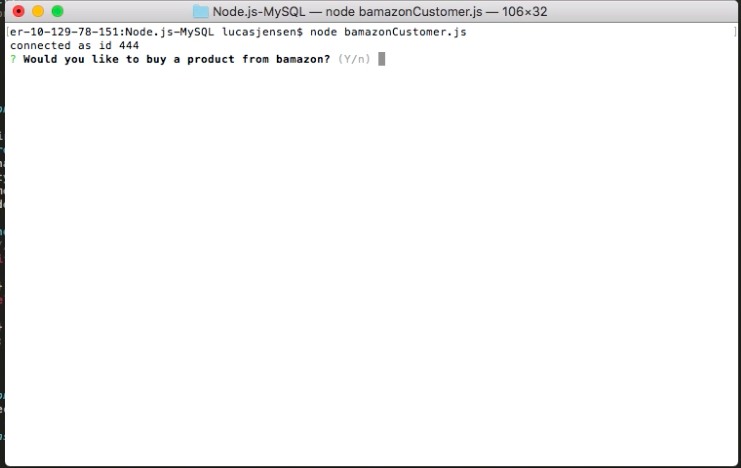
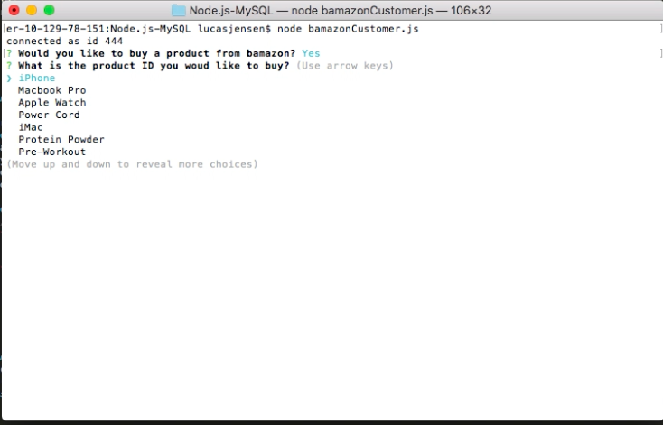
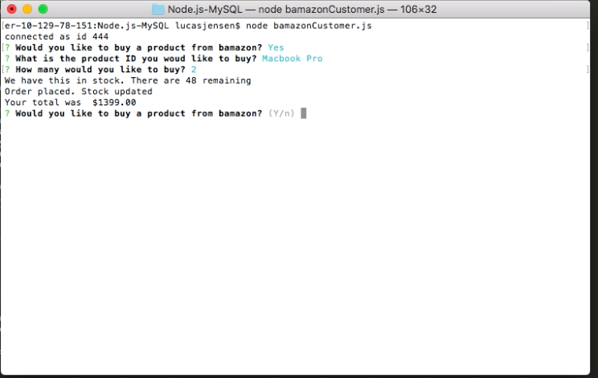
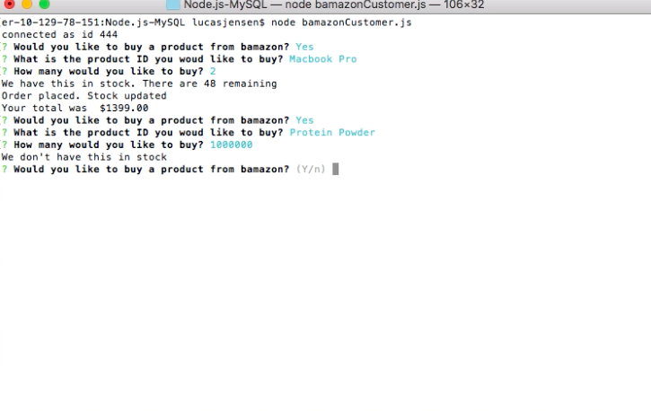
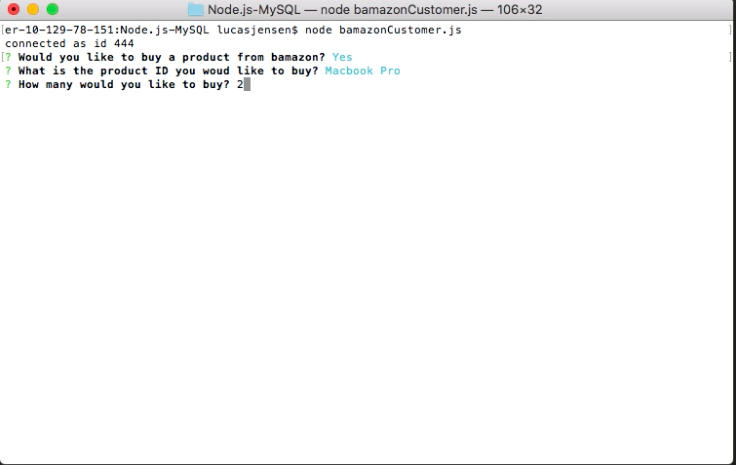

# Node.js-MySQL

## Introduction

### How to Use

## Step One
 Open Ternimal and enter node bamazonCustomer.js. 
 You will prompted with a message if you would like to buy a product from bamazon?
 

 

## Step Two
You will then be prompted with a list of products to choose from.
After selecting a product, enter how many you would like to purchase

## Step Three
The app will show if there is stock available. 
If stock is available, the order will be placed and the total cost will be displayed. 

## Step Four

## Step Five

